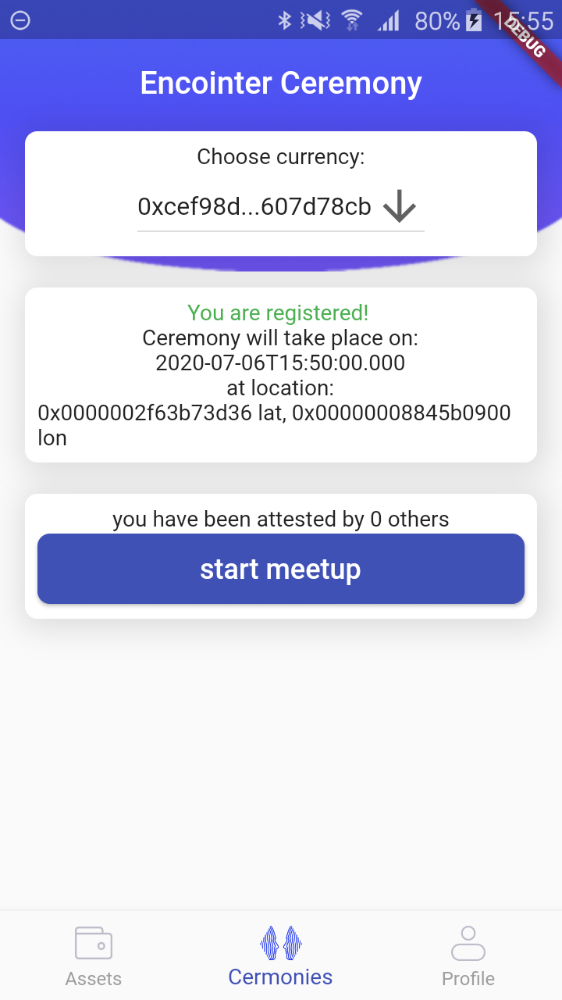

# Encointer Wallet

Encointer wallet and client for mobile phones

[](https://f-droid.org/packages/org.encointer.wallet/)
     
[](https://play.google.com/store/apps/details?id=org.encointer.wallet)
     
<a href="https://apps.apple.com/us/app/encointer-wallet/id1535471655?itsct=apps_box_badge&amp;itscg=30200" style="display: inline-block; overflow: hidden; border-radius: 13px; width: 250px; height: 83px;"></a>

[](https://github.com/encointer/encointer-wallet-flutter/actions/workflows/android_build.yml)
[](https://github.com/encointer/encointer-wallet-flutter/actions/workflows/android_integration_test.yml)
[](https://github.com/encointer/encointer-wallet-flutter/actions/workflows/ios_integration_test.yaml)
[](https://github.com/encointer/encointer-wallet-flutter/actions/workflows/unit_tests.yaml)

## Overview





## Build Instructions

### Install Flutter

Built with [Flutter](https://flutter.dev/), you need to have `Flutter` dev tools
installed on your computer to compile the project. check [Flutter Documentation](https://flutter.dev/docs)
 to learn how to install `Flutter` and initialize a Flutter App.

### Build js dependencies

Encointer wallet connects to the chains with [polkadot-js/api](https://polkadot.js.org/api/), running in a hidden webview.
You'll need `Nodejs` and `yarn` installed to build the bundled `main.js` file:

```shell script
cd lib/js_service_encointer/
# install nodejs dependencies
yarn install
# build main.js
yarn run build
```

### Run App

If you have an AVD or real device attached, you can do

```
flutter run --flavor dev
```

### Build APK

You may build the App with Flutter's [Deployment Documentation](https://flutter.dev/docs).

In order to build a fat APK, you can do 
```
flutter build apk --flavor fdroid
```
and find the output in `build/app/outputs/apk/fdroid/release/app-fdroid-release.apk`

For the play store, an appbundle is preferred:
```
flutter build appbundle
```
and find the output in `build/app/outputs/bundle/release/app-release.aab`

#### Dev hints

Currently supports flutter: 2.02

Re-generate mobx g.dart files
  flutter packages pub run build_runner build --delete-conflicting-outputs
  
### Run tests

* run all tests from the command line:`flutter test`
* run tests in specific directory: `flutter test test/page-encointer`

### Integration tests
* run all integration tests in `test_driver` directory: `flutter drive --target=test_driver/app.dart --flavor dev`

### Automated screenshots
* Github actions is used to create automated screenshots for the specified devices there. However, running the integration tests locally will create screenshots for the currently running device.

#### Android Studio
To run the in Android Studio a build flavor must be specified. Go to Run/Debug configurations and add the build flavor `dev` in the appropriate field. Other available values are in the in the android/app/src/build.gradle file.

>Note that this project can be compiled both in Android and IOS,
>But there is an Issue running it on an IOS simulator, that the
>substrate `sr25519` keyPair is generated within an `WASM` virtual
>machine which is **not supported** by IOS simulators.

## Developer Remarks

### Windows Local Dev-setup
Setup to talk from emulators and/or cellphones with an encointer-node in the same local network. In windows 10/11 some
 OS fixes are needed to get this working. I don't know if all of these steps are required.

1. Make PC discoverable in local network.
2. Enable inbound connections in windows firewall:
    * Search: `Windows Defender Firewall with Advanced Security`.
    * Inbound Rules > New Rule > Rule Type: Port > Tick TCP and specify the node's port, e.g. 9944.
    * Click next until finished and give the rule a distinct name, e.g. `Substrate Node`.
    * Double check if the rule is activated.
3. Find your local IP in the network and enter it in the encointer-wallet's [config](https://github.com/encointer/encointer-wallet-flutter/blob/1abb8a1f54ef551f19598fb809dfd6378cf1ac43/lib/config/consts.dart#L16-L23).
4. Restart the computer to be sure that the new configs are active.
5. Run the node with the flags: `./target/release/encointer-node-notee --dev --enable-offchain-indexing true --rpc-methods unsafe -lencointer=debug --ws-external --rpc-external`

If the node is run in WSL2 (WSL1 should be fine), some extra steps are needed:

6. WSL2 does only expose ports on the local interface, which means they only listen to `127.0.0.1`, hence WSL2 can't be 
accessed on `hostname/-ip` on other devices in the LAN. This can be fixed with a simple tool [WSLHostPatcher](https://github.com/CzBiX/WSLHostPatcher).
    * Download the release.zip
    * Run `WSLHostPatcher.exe`
    * (Re-)start the service in WSL2. A firewall warning will pop-up the first time and access must be granted.

7. Now you should be able to access the node with both, the emulator and a cellphone in the local network.

**Note**: The `WSLHostPatcher.exe` must be run after every OS restart. You can automatically run it with the following steps:
* Download the release.zip, unzip it and put it into the ProgramFiles folder, giving it a more suitable name.
* Press `windows key + r` and type `shell:startup`.
* Add a shortcut to the `WSLHostPatcher.exe` in the windows startup folder.

### Fmt
`dartfmt` lacks config file support, which implies that customizations need to be done by users individually. The default 
limit of 80 characters line length conflicts with the deeply nested structure of flutter's declarative code for designing 
widgets. This causes many unwanted linebreaks that reduce the readability of flutter code. Hence, we increase the line
 length of the code to 120.

* Settings > Dart > Line length 120.
* Autoformat on save: Settings > Languages and Frameworks > then tick: `Format code on save`, `Organize imports on save`.
* Format the whole codebase with: `flutter format . --line-length 120`.

#### Other fmt hints:

* Define formatting with the help of [trailing commas](https://docs.flutter.dev/development/tools/formatting#using-trailing-commas).
* [Dartfmt FAQ](https://github.com/dart-lang/dart_style/wiki/FAQ).


### Update generated files.
The flutter build-runner is used to generate repetitive boiler-plate code that is generated based on code annotations,
e.g. `@JsonSerializable` or the mobx annotations. Whenever annotations are added, changed or removed, the following 
command must be run to update the `*.g` files.

*  `flutter pub run build_runner build --delete-conflicting-outputs` 

### Release Flow

F-Droid triggers builds based on the version it reads from pubspec.yaml which it reads from branch `beta` HEAD`.
AppCenter automatically builds and deploys the HEAD of `beta`

VersionName should follow semver. Minor version bump on pre-1.0.0 release indicates breaking change

VersionCode should monotonically increase by 1 for every tagged build

  # bump version on some commit on master

```shell 
  git checkout master
  git tag v0.9.0
  git push
  git checkout beta
  git merge v0.9.0
  git push
```

## Acknowledgements

This app has been built based on [polkawallet.io](https://polkawallet.io)
