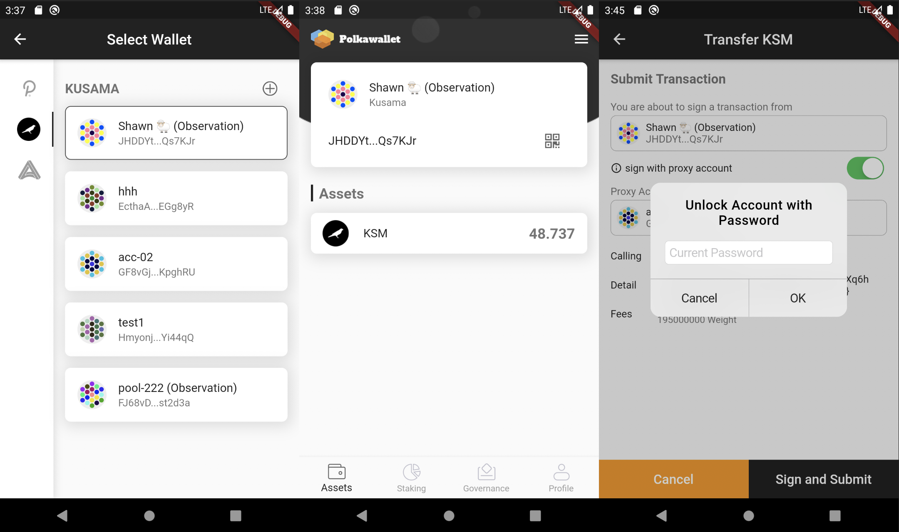

# polkawallet-flutter

### Download
[](https://apps.apple.com/us/app/polkawallet/id1520301768)
[](https://play.google.com/store/apps/details?id=io.polkawallet.www.polka_wallet)

----

[](https://travis-ci.com/polkawallet-io/polkawallet-flutter)
[](https://github.com/polkawallet-io/polkawallet-flutter/releases)
[](https://github.com/polkawallet-io/polkawallet-flutter/tags)

Polkawallet built with Flutter, https://polkawallet.io


### Introduction

 [Polkawallet](http://polkawallet.io) provide one-stop management for cross-chain assets, convenient staking and governance operations, and the private key is self-owned. 



Polkawallet is aiming to provide a more convenient entrance of the polkadot network for all the users of Polkadot/Kusama/Substrate-based-blockchains.

- Friendly UI.
- Secure local accounts storage.
- Intuitive Tokens management.
- Simplified staking & governance operations.
- Offline signature supported.
- Available for both IOS and Android.

### Features
- [x] Account management for all Substrate-based-blockchains(i.e. Polkadot, Kusama, Acala...).
- [x] Import account with Mnemonics, Raw Seed and Keystore. Encrypt type Sr/Ed25519 supported, HD Derivation supported.
- [x] Social recovery.
- [x] Token transfer/staking/governance supported in Kusama/Polkadot.
- [x] DOT claim in Polkadot.
- [x] Token transfer/loan/swap/liquid-DOT supported in Acala Network testnet.
- [x] Token-transfer/synthetic-swap/margin-trade supported in Laminar testnet.
- [x] Basic account settings: changing name/password/address prefix/language/remote node.

### Todos

- [ ] Login polkassembly with a wallet account.
- [ ] Refactor the App to support any Substrate-based-blockchain to integrate as plugins.

### Building

#### Dependencies

- `Flutter 1.20.x statble` 
- `Dart 2.7.x` 
- `Node 12.x` 

#### Install Flutter 
`polkawallet_flutter` is built with [Flutter](https://flutter.dev/), you need to have `Flutter` dev tools
installed on your computer to compile the project. check [Flutter Documentation](https://flutter.dev/docs)
 to learn how to install `Flutter` and initialize a Flutter App.

#### Build `main.js` of polkadot-js API
`polkawallet_flutter` connects substrate-based networks with [polkadot-js/api](https://polkadot.js.org/api/), running in a hidden webview.
You'll need `Nodejs` and `yarn` installed to build the bundled `main.js` file:
```shell script
cd lib/polkadot_js_service/
# install nodejs dependencies
yarn install
# build main.js
yarn run build
```

#### Build Flutter App
While `main.js` was built in `lib/polkadot_js_service/` directory, you may build the App with Flutter's [Deployment Documentation](https://flutter.dev/docs).
>Note that this project can be compiled both in Android and IOS,
>But there is an Issue running it on an IOS simulator, that the
>substrate `sr25519` keyPair is generated within an `WASM` virtual
>machine which is **not supported** by IOS simulators.

### FAQ

> Why use Flutter to develop?

The previous version tried to develop Polkawallet with React Native, we want to try different frameworks and explore different solutions. Through exploration, we saw that the fluency of the Flutter version has greatly improved, which is a good attempt.

> Can other teams make secondary development based on Polkawallet?

Of course, we use a very loose Apache License 2.0, you can make free changes based on Polkawallet. We have contacted some projects to help them carry out secondary development. Such as datahighway.com
There have the link of Github repository: https://github.com/polkawallet-io/polkawallet-flutter/tree/develop

> How can Polkawallet maintain development?

We got grants from Web3 Foundation, at the same time, we are helping Acala Network to develop convenient mobile interactions. In the future we want to actively join the ParaDAO that Acala Network is launching, this can be a way for many ecological projects to come together. Through ParaDAO, infrastructures such as Polkawallet and Parachain projects all have clear maintenance development plans.


### View more info of Polkawallet
`Website:` https://polkawallet.io  
`Twitter:` https://twitter.com/polkawallet  
`E-mail:`  hello@polkawallet.io  

### Tipping address

Kusama address: `EyWJe5kRSpDXLSaUxE3WcoDSgSos2TpRL2rSSd45R61YRqH`
